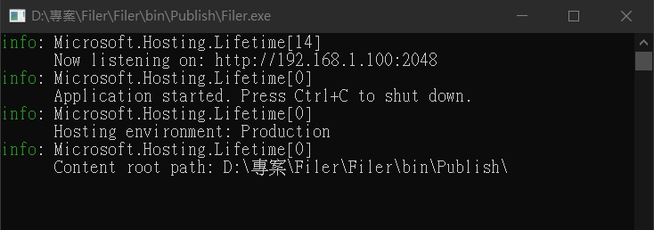
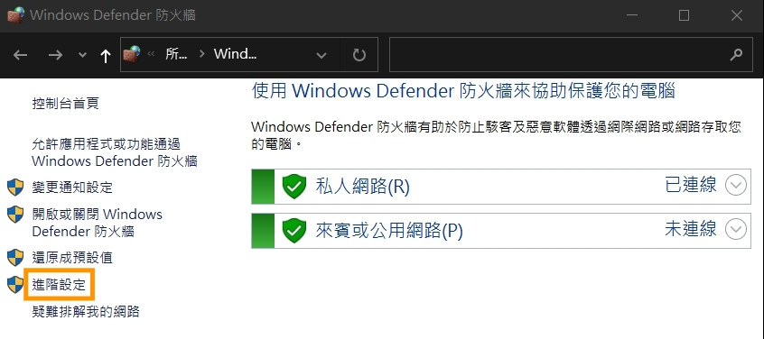
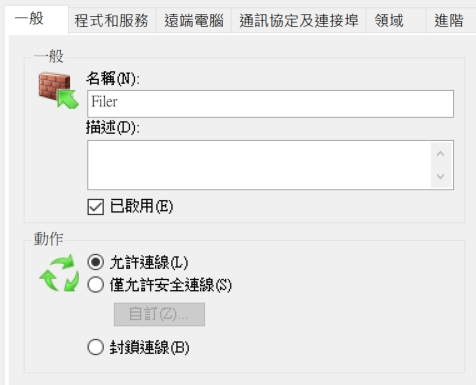
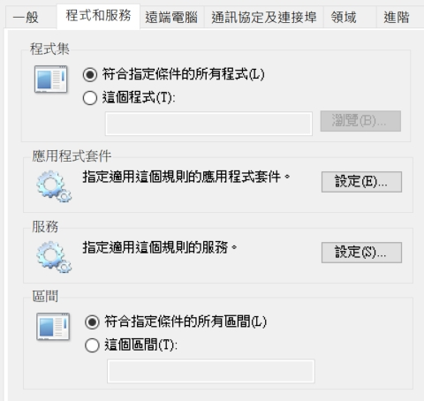
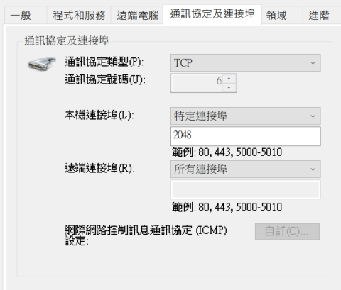
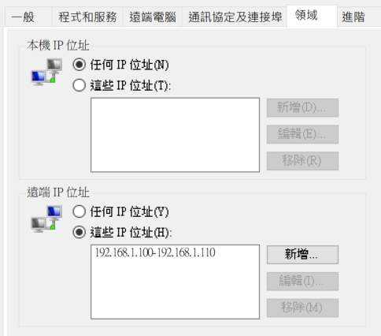
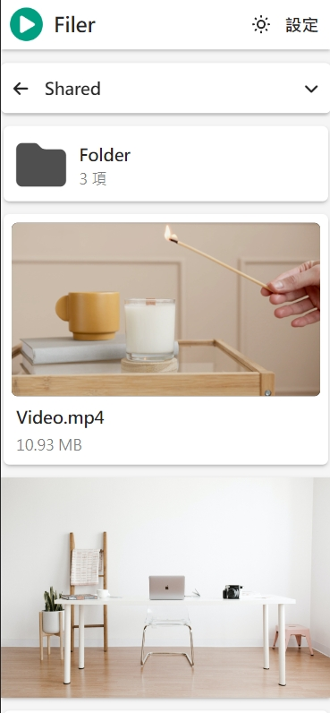

# Filer  

This is a file browser, you can use your mobile device to browse files on your computer on a local area network.  

---  

### Get Started  

1. Download and unzip the file.  
[releases/Filer-v1.0.0.zip](https://github.com/fysh711426/Filer/releases)  

2. Open and setting `appsettings.json`.  

```Json
// Set server ip and port
// http://{server_ip}:{port}
"Kestrel": {
  "Endpoints": {
    "Http": {
      "Url": "http://192.168.1.100:2048"
    }
  }
}
```

```Json
// Set shared directory
"WorkDirs": [
  {
    "Name": "Shared",
    "Path": "D:\\Shared"
  }
]
```

3. Execute `Filer.exe`.  

  

---  

### Add firewall rules  

The firewall blocks the ports of the computer, so we need to set up rules to allow specific IP connections.  

1. Open `Windows Defender` Advanced settings.  

  

2. Add input rules.  

  

  

  

  

> Specify IP address between `192.168.1.100` and `192.168.1.110` to connect.  

---  

### Demo  

Open url on mobile.  

  